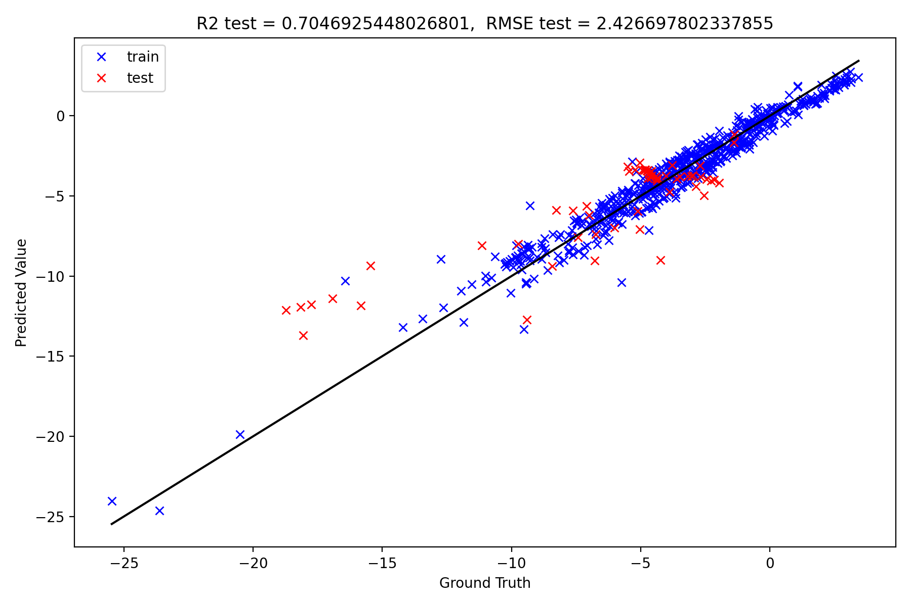
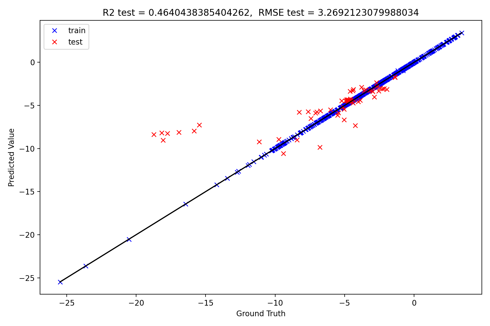
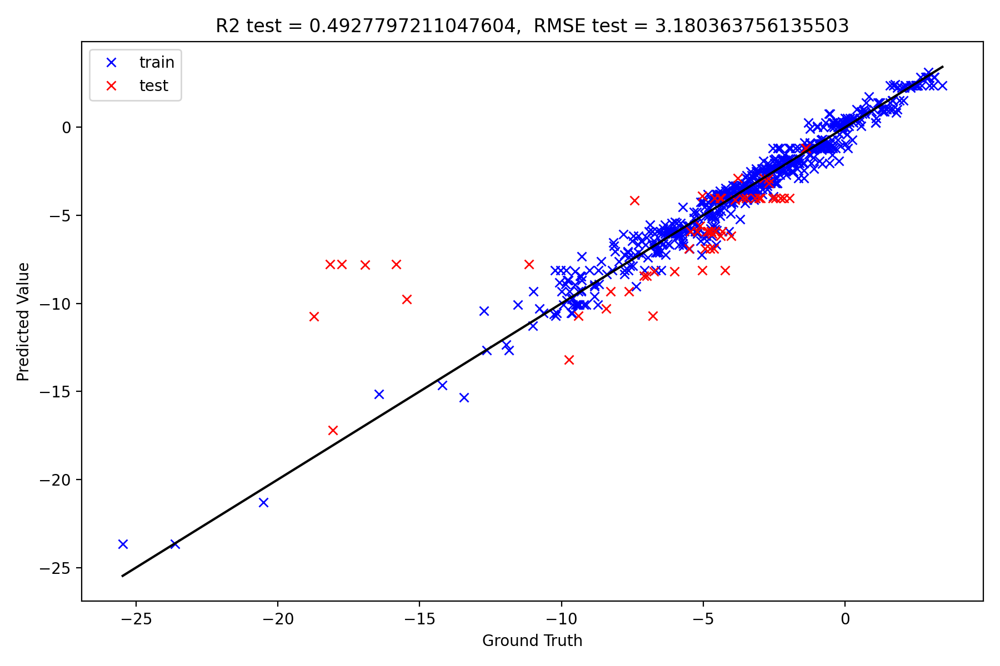

Getting started
===============

Installation
============

A new environment can be initialised using ``make create_environment``. This should then be activated before installing the requirements with the ``make requirements`` command.

Quickstart
==========

Once the environment is set up, from the root directory of the repository, the chatbot can be initialised as follows::

    from src.models.molecular_sklearn_regressor import MolecularSKLearnRegressor
    import src.drug_discovery_agent.agent as agent

    vectordb_dir = Path("vector_db_dir/")
    paper_path=Path("/data/example_papers/example_drug_discovery_paper.pdf")
    vectordb_dir.mkdir(exist_ok=True)

    pretrained_root_path = Path('models')
    predictor_model = MolecularSKLearnRegressor.from_pretrained(
        sklearn_model_path=pretrained_root_path/'sklearn_model.pkl',
        featurizer_yaml_path=pretrained_root_path/'featurizer_state_dict.yml',
        scaler_path=pretrained_root_path/'scaler.pkl',
    )

    my_drug_discovery_chatbot = agent.DrugDiscoveryChatBot(
        pdf_path=paper_path,
        vectordb_dir = vectordb_dir,
        hydration_free_energy_predictor=predictor_model,
    )

For other options see the docs.

To query the chatbot, use the ``DrugDiscoveryChatBot.chat()`` function::

    result = my_drug_discovery_chatbot.chat("What disease are they discussing in the paper?")
    print(result)

To reset the chat history, use a new ``session_id``::

    result = my_drug_discovery_chatbot.chat("Please summarise the paper.",
                                             session_id = 1)
    print(result)

Model performance
=================

In ``notebooks/train_predictive_model.ipynb`` several sklearn models are trained on the freesolv dataset. A scaffold split is used to attempt to obtain metrics on the testset that will generalise to unseen molecules.

The three models trained are a Random Forest Regressor model, an XGBoost model, and a Support Vector Regressor model.

Of the three the Support Vector Regressor generalises to the test set the best and so this is the model that is saved into the ``models/`` directory.

Support Vector Regressor model
-------------------------------

Random Forest Regressor model
------------------------------

XGBoost Regressor model
-----------------------

